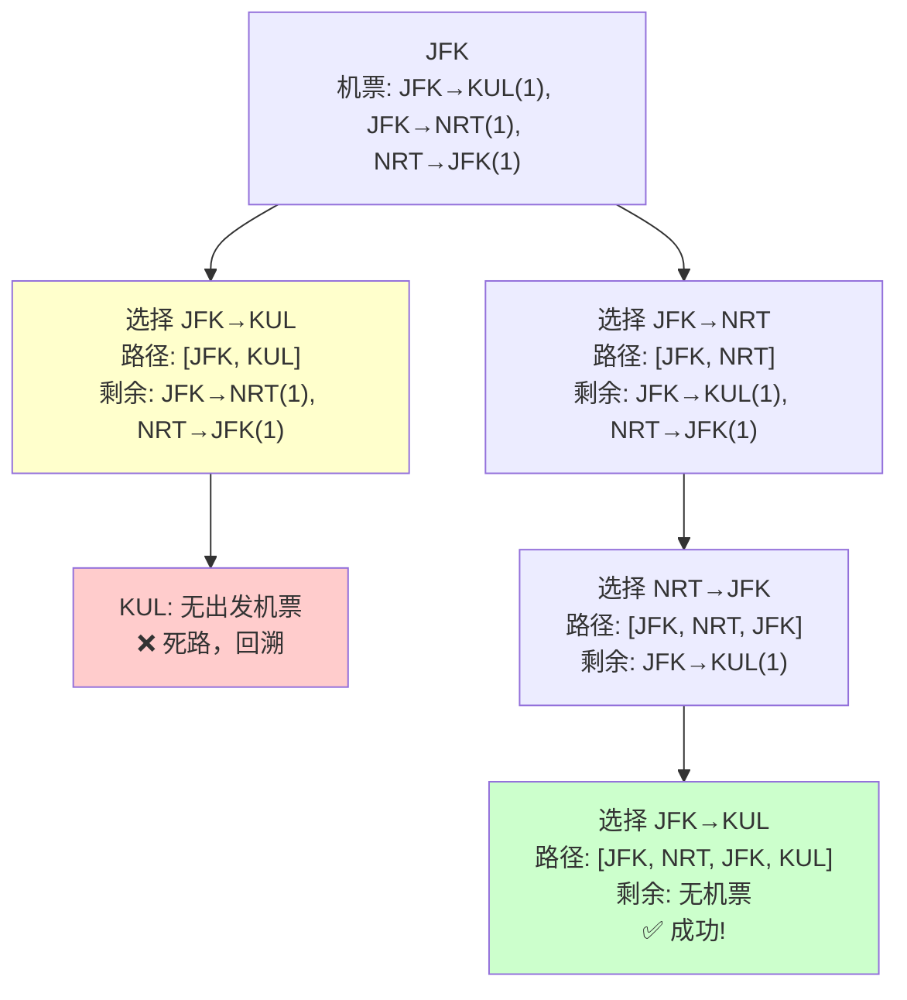

# {{ $frontmatter.title }}

#### 题目描述

给你一份航线列表 `tickets` ，其中 `tickets[i] = [fromi, toi]` 表示飞机出发和降落的机场地点。请你对该行程进行重新规划排序。

所有这些机票都属于一个从 `JFK`（肯尼迪国际机场）出发的先生，所以该行程必须从 `JFK` 开始。如果存在多种有效的行程，请你按字典排序返回最小的行程组合。

- 例如，行程 `["JFK", "LGA"]` 与 `["JFK", "LGB"]` 相比就更小，排序更靠前。

假定所有机票至少存在一种合理的行程。且所有的机票 必须都用一次 且 只能用一次。

题目链接：[332](https://leetcode.cn/problems/reconstruct-itinerary)

文章讲解：[332](https://programmercarl.com/0332.%E9%87%8D%E6%96%B0%E5%AE%89%E6%8E%92%E8%A1%8C%E7%A8%8B.html)

#### 思考

这道题只能用暴力搜索来解决，我们来模拟一下整个过程。

拿 `[["JFK", "KUL"], ["JFK", "NRT"], ["NRT", "JFK"]]` 这个例子来说：

从JFK出发，手里有两张从JFK出发的机票。按照字典序，KUL < NRT，所以先选KUL那张。飞到KUL后一看，手里没有从KUL出发的机票了，这就走进死胡同了。没办法，只能回头，把刚才用掉的JFK→KUL机票重新放回去，回到JFK重新选择。

这次选择JFK→NRT，飞到NRT后发现还有一张NRT→JFK的机票，用掉它飞回JFK。回到JFK后发现还有一张JFK→KUL的机票没用，用掉它飞到KUL。这时候所有机票都用完了，任务完成！

文字描述确实比较抽象，看图会更清楚：

从图中理解



或者carl的图


#### 数据结构的选择

最开始我想用 `unordered_map<string, map<string, string>>` 来存储机票信息，第一个string是出发机场，map里存放目的地信息。但这样有个问题：每次回溯都要在map中增删元素，开销太大了。

后来想到一个更巧妙的方法：用 `unordered_map<string, map<string, int>>` 来表示 `<出发机场, <到达机场, 航班次数>>`。

这样做的好处是：

- map会自动按照目的地的字典序排序，满足题目要求
- 不需要真的删除元素，只需要把航班次数减1就行了
- 回溯的时候把航班次数加1就能恢复状态

如果航班次数大于0，说明这个目的地还能飞；如果等于0，说明这条航线已经用完了。这样避免了频繁的增删操作，效率高多了。

##### 回溯三部曲

**递归函数的参数**

- `ticketsNum`：总机票数量
- `result`：当前的行程路径（在主函数中初始化为["JFK"]）

**终止条件** 有两种情况会终止递归：

1. 所有机票都用完了（`result.size() == ticketsNum + 1`），返回true表示找到答案
2. 当前机场没有可用的出发机票了，自然退出循环，返回false表示需要回溯

**单层搜索逻辑** 遍历当前机场的所有目的地：

- 选择：消耗一张机票，将目的地加入路径
- 递归：如果从这个目的地能找到完整路径，直接返回true
- 回溯：如果走不通，恢复机票数量，从路径中移除目的地

整个过程就像在一个迷宫里找路，遇到死路就退回来换条路走，直到找到出口为止。

#### 代码实现

回溯法

```C++
class Solution {
private:
// unordered_map<出发机场, map<到达机场, 航班次数>> targets
unordered_map<string, map<string, int>> targets;
bool backtracking(int ticketNum, vector<string>& result) {
    if (result.size() == ticketNum + 1) {
        return true;
    }
    for (pair<const string, int>& target : targets[result[result.size() - 1]]) {
        if (target.second > 0 ) { // 记录到达机场是否飞过了
            result.push_back(target.first);
            target.second--;
            if (backtracking(ticketNum, result)) return true;
            result.pop_back();
            target.second++;
        }
    }
    return false;
}
public:
    vector<string> findItinerary(vector<vector<string>>& tickets) {
        targets.clear();
        vector<string> result;
        for (const vector<string>& vec : tickets) {
            targets[vec[0]][vec[1]]++; // 记录映射关系
        }
        result.push_back("JFK"); // 起始机场
        backtracking(tickets.size(), result);
        return result;
    }
};
```

#### 优化

后续发现这道题目使用回溯算法超时了

回顾carl给的图，我们访问了两次KUL，第一次发现错误路程，走到了死胡同，并且手中还有余票说明死胡同不是最后一个城市。我们走错了，所以我们回溯。回到了JFK

第二次访问KUL时，用完了所有的票。找到了正确路径，这是这个死胡同是最后一个访问的。

所以说这里第一次当问KUL是无效访问。

暴力回溯的致命弱点在于**大量的无效探索和状态重置**。它可能会深入一条很长的错误路径，最后发现走不通，然后必须一步步地撤销（回溯）所有操作，再尝试另一条分支。

也就是说，当我们贪心地选择字典序最小的节点前进时，我们可能先走入「死胡同」，从而导致无法遍历到其他还未访问的边。于是我们希望能够遍历完当前节点所连接的其他节点后再进入「死胡同」-----[力扣官方题解](https://leetcode.cn/problems/reconstruct-itinerary/solutions/389885/zhong-xin-an-pai-xing-cheng-by-leetcode-solution/)


**Hierholzer 算法的核心优化在于，它从不“浪费”走过的任何一条路。**

1. **确定性与贪心**: 在任何一个机场，Hierholzer 算法（在结合了字典序要求后）的选择是**确定性的、贪心的**：它总是走向字典序最小的下一个机场。它不“尝试”，它直接“行进”。
2. **对“死胡同”的巧妙处理 (关键优化点)**:
   - **回溯法**：当遇到死胡同（当前机场无路可走）但还有机票未用时，回溯法认为“此路不通”，会撤销路径，返回去尝试别的分支。这是一种**试错 (Trial and Error)**。
   - **Hierholzer**：当遇到死胡同，Hierholzer 算法得出的结论是：“这个机场一定是当前这段旅程的终点”。它并不认为这是失败，而是**找到了一个子路径的终点**。于是，它非常自信地将这个死胡同机场“固化”为最终路径的一部分（加入结果集），然后才返回上一层。
3. **从不丢弃路径**:
   - **回溯法**：会构建路径，然后又可能完整地拆掉它。
   - **Hierholzer**：每走一步（即访问一条边），这条边就**永久性地**从图中移除了。算法的每一步都是在构建最终路径，只是顺序是反的。它绝不会撤销已经走过的路，这避免了大量的重复计算。

Hierholzer 算法

```C++
class Solution  {
private:
    unordered_map<string, map<string, int>> graph;
    
public:
    vector<string> findItinerary(vector<vector<string>>& tickets) {
        graph.clear();
        
        // 构建图，map确保字典序
        for (const auto& ticket : tickets) {
            graph[ticket[0]][ticket[1]]++;
        }
        
        vector<string> result;
        dfs("JFK", result);
        
        // 由于是后序遍历，需要反转结果
        reverse(result.begin(), result.end());
        return result;
    }
    
private:
    // 使用DFS + 后序遍历的思想
    void dfs(const string& from, vector<string>& path) {
        while (!graph[from].empty()) {
            // 获取字典序最小的目的地
            auto it = graph[from].begin();
            string to = it->first;
            
            // 使用这张机票
            if (--it->second == 0) {
                graph[from].erase(it);
            }
            
            // 继续DFS
            dfs(to, path);
        }
        
        // 后序遍历：在回溯时添加到路径
        path.push_back(from);
    }
};
```

这个算法保证了死胡同一定是最后入栈的。为什么？

假如死胡同分支字典序小，那么就会先调用，先加入path。

假如死胡同分支字典序大，那么会先调用非死胡同分支，并且这个分支一定 一定还会再次回到当前节点。这时就会再调用死胡同分支。这样死胡同分支最后被遍历到。仍然最先加入path。

举例，算法会先“贪心”地冲进一条字典序最小的路径 `JFK -> KUL`。当发现 `KUL` 是一个死胡同后，它并不会慌张地回溯，而是确定 `KUL` 必定是最终行程的最后一站。然后它才回过头来，完成 `JFK -> NRT -> JFK` 这个环路，并把这个环路优美地“拼接”在 `KUL` 的前面。

或者使用multiset记录机票

```C++
class Solution {
public:
    /**
     * @brief 主函数，负责流程控制：构建图、启动DFS、返回结果。
     * @param tickets 机票列表
     * @return 字典序最小的行程
     */
    vector<string> findItinerary(vector<vector<string>>& tickets) {
        // Step 1: 清理状态，确保对象可以被重复使用
        graph.clear();
        result.clear();
        
        // Step 2: 构建图的邻接表
        for (const auto& ticket : tickets) {
            graph[ticket[0]].insert(ticket[1]);
        }

        // Step 3: 从起点 "JFK" 开始调用DFS辅助函数
        dfs("JFK");

        // Step 4: Hierholzer算法是逆序构建路径的，所以需要反转
        reverse(result.begin(), result.end());
        
        return result;
    }

private:
    // 将图和结果作为类的私有成员，封装状态
    unordered_map<string, multiset<string>> graph;
    vector<string> result;

    /**
     * @brief DFS 辅助函数，封装了 Hierholzer 算法的核心递归逻辑。
     * @param airport 当前所在的机场
     */
    void dfs(const string& airport) {
        // 当这个机场还有可以飞往的目的地时
        while (graph.count(airport) && !graph[airport].empty()) {
            // 提取字典序最小的目的地
            string next_airport = *graph[airport].begin();
            
            // 从图中“用掉”这张机票
            graph[airport].erase(graph[airport].begin());
            
            // 递归地访问下一个机场
            dfs(next_airport);
        }
        
        // 当一个机场的所有出路都被访问完后（到达“死胡同”），
        // 将这个机场压入结果列表。
        result.push_back(airport);
    }
};
```

