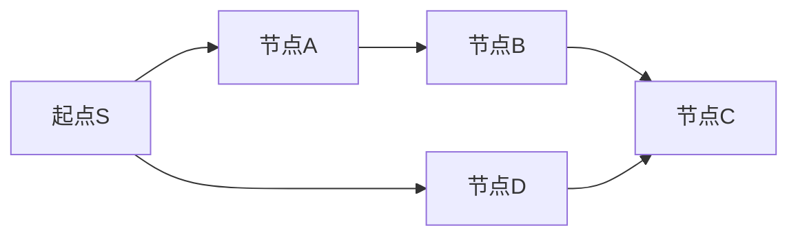

# Bellman-Ford之单源有限最短路

#### 题目描述

某国为促进城市间经济交流，决定对货物运输提供补贴。共有 n 个编号为 1 到 n 的城市，通过道路网络连接，网络中的道路仅允许从某个城市单向通行到另一个城市，不能反向通行。

网络中的道路都有各自的运输成本和政府补贴，道路的权值计算方式为：运输成本 - 政府补贴。

权值为正表示扣除了政府补贴后运输货物仍需支付的费用；

权值为负则表示政府的补贴超过了支出的运输成本，实际表现为运输过程中还能赚取一定的收益。

请计算在最多经过 k 个城市的条件下，从城市 src 到城市 dst 的最低运输成本。

题目链接：https://kamacoder.com/problempage.php?pid=1154

文章讲解：https://programmercarl.com/kamacoder/0096.%E5%9F%8E%E5%B8%82%E9%97%B4%E8%B4%A7%E7%89%A9%E8%BF%90%E8%BE%93III.html

#### 思考

这道题是单源有限最短路径，即在bellman-ford算法基础上呢增加了最多经过k个城市。

原来是n个城市从1到你。现在不到n了，而是到任意选择的一个城市dst 。

题目描述要求最多经过k个城市是什么意思？是告诉我们从src到dst之间最多有k个城市。即最多需要经历k+1条路。和原来的说法对照一下"从1到n，最多经历n-1路"。其实是一样的说法。

所以我们进行k+1轮次松弛呗：

```C++
版本一
#include <cstdint>
#include <iostream>
#include <vector>

using namespace std;

struct Edge {
    int p1;
    int p2;
    int val;

    Edge(int p1, int p2, int val) : p1(p1), p2(p2), val(val) {}
};

int main() {
    int src, dst,k ,n, m, s, t, v;
    cin >> n >> m;

    vector<Edge> edges;
    for (int i = 0; i < m; i++) {
        cin >> s >> t >> v;
        edges.push_back(Edge(s, t, v));
    }
    cin >> src >> dst >> k;
    vector<int> minDist(n + 1, INT32_MAX);
    minDist[src] = 0;
    bool flag = false;
    // Bellman-Ford算法：进行k+1轮松弛，添加提前终止条件
    for (int i = 1; i < k+2; i++) {
        bool updated = false; // 标记本轮是否有更新

        for (auto edge : edges) {
            int start = edge.p1;
            int end = edge.p2;
            int val = edge.val;
            // 松弛操作
            if (minDist[start] != INT32_MAX &&
                minDist[end] > minDist[start] + val) {
                minDist[end] = minDist[start] + val;
                updated = true; // 标记发生了更新
            }
        }
        cout << "minDist: ";
        for (int j = 0; j < minDist.size(); j++) {
            cout << minDist[j] << " ";
        }
        cout << endl;
        // 提前终止条件：如果本轮没有任何更新，说明已经收敛
        if (!updated) {
            cout << "算法在第 " << i << " 轮提前收敛" << endl;
            break;
        }
    }
    if (minDist[dst] == INT32_MAX)
        cout << "unconnected" << endl;
    else
        cout << minDist[dst] << endl;
}
```

但是提交发现答案错误了。为什么？

在原来的bellman-ford算法中我们的思路是 **最多**对所有边松弛n-1轮，minDist 就一定不再变化，得到了从1到n的最短距离。在松弛的过程中，会产生**一轮松弛里面  连续松弛超过松弛轮次范围的边  **的情况。导致提前收敛，我们使用了一个标志位 **记录本轮松弛有无成功/minDist有无更新** 来做到这一点。当然没有这个判断提前收敛也可以，我们的n-1次保证了能得到正确答案。

那么**一轮松弛里面  连续松弛超过松弛轮次范围的边** 这个说法换句话理解就是**这轮松弛 计算了 起点到达 与 多于起点松弛轮次 条边 相连的节点的 最短距离**。 

举例：第1轮松弛计算了**起点** 与 2或3或4条边相连的节点的最短距离。

这个图：


会在第一轮松弛计算 节点1 到节点4 的最短距离。一次松弛就达成了正确答案。松弛轮次没有限制到计算最短路径所经历的节点数量！或者说违反了"轮数=边数"的对应关系会导致什么后果？

以卡尔给的例子说明


按照输入顺序

```C++
4 4
1 2 -1
2 3 1
3 1 -1
3 4 1
1 4 3
```

按照以上输入顺序，minDist的变化是

```C++
minDist: max -1 -1 0 1
minDist: max -2 -2 -1 0
minDist: max -3 -3 -2 -1
minDist: max -4 -4 -3 -2
```

可以发现 对所有边松弛第一次的过程中，不仅仅 与起点一条边相连的节点更新了，所有节点都更新了。

后面几次松弛，同样是更新了所有的节点，说明 至多经过k 个节点 这个限制 根本没有限制住，每个节点的数值都被更新了。

这就是**松弛轮次和边数量不对应**的情况。没有做到 “ **对所有边松弛一次，相当于计算 起点到达 与起点一条边相连的节点 的最短距离** “”这个要求。

我们暂且不表为什么一定要做到这个要求而是继续来看边的顺序影响。

#### 边的顺序

将边的顺序改为

```	c++
4 4
3 1 -1
3 4 1
2 3 1
1 2 -1
1 4 3
```

得到minDist变化：

```C++
minDist: max 0 -1 max max 
minDist: max 0 -1 0 max
minDist: max -1 -2 0 1
minDist: max -1 -2 -1 1
```

这一次发现得到了正确答案 1。

边的顺序不同，松弛轮次和边数量不一致就会导致这个问题。

那么如何做到这一点保证（理论上来说，**对所有边松弛一次，相当于计算 起点到达 与起点一条边相连的节点 的最短距离**）呢？

为了保证避免：计算minDist数组的时候，基于了本次松弛的 minDist 数值，而不是上一次 松弛时候minDist的数值。避免这种连续松弛。

必须要做到：在每次计算 minDist 时候，要基于 对所有边上一次松弛的 minDist 数值才行，所以我们要记录上一次松弛的minDist。

使用备份数组很好的做到这一点。在松弛完必要的边后，在下一轮获取上一轮计算结果

```	C++
// 版本二
#include <iostream>
#include <vector>
#include <list>
#include <climits>
using namespace std;

int main() {
    int src, dst,k ,p1, p2, val ,m , n;
    
    cin >> n >> m;

    vector<vector<int>> grid;

    for(int i = 0; i < m; i++){
        cin >> p1 >> p2 >> val;
        grid.push_back({p1, p2, val});
    }

    cin >> src >> dst >> k;

    vector<int> minDist(n + 1 , INT_MAX);
    minDist[src] = 0;
    vector<int> minDist_copy(n + 1); // 用来记录上一次遍历的结果
    for (int i = 1; i <= k + 1; i++) {
        minDist_copy = minDist; // 获取上一次计算的结果
        for (vector<int> &side : grid) {
            int from = side[0];
            int to = side[1];
            int price = side[2];
            // 注意使用 minDist_copy 来计算 minDist 
            if (minDist_copy[from] != INT_MAX && minDist[to] > minDist_copy[from] + price) {  
                minDist[to] = minDist_copy[from] + price;
            }
        }
    }
    if (minDist[dst] == INT_MAX) cout << "unreachable" << endl; // 不能到达终点
    else cout << minDist[dst] << endl; // 到达终点最短路径

}

```

#### 核心思想

那么做到这个保证（理论上来说，**对所有边松弛一次，相当于计算 起点到达 与起点一条边相连的节点 的最短距离**）为什么这么重要呢？？


核心原理：逐层扩展的思想 🌊

为什么要"一层一层"地扩展？

**如果我们要找最短路径，最直观的方法是什么？**

**从起点开始，一步一步地向外扩展，确保每一步都是最优的**

这个"一条边一条边"的基础实际上是**数学归纳法**在图算法中的应用：

归纳基础

- **第0轮**：起点到自己的距离是0，到其他点距离是∞

归纳假设  

- **第k轮后**：我们已经正确计算出了所有"最多k条边"的最短路径

归纳步骤

- **第k+1轮**：基于第k轮的结果，计算所有"最多k+1条边"的最短路径

为什么这个基础如此重要？ 

1. **保证算法正确性** 

如果跳过这个基础，就无法保证：
- 每一步的计算都是基于已知的最优解
- 算法会在有限步内收敛到全局最优

2. **建立清晰的计算边界** 📏

让我用一个例子说明：



**第1轮**：只能到达A和D（与起点直接相连）
**第2轮**：能到达B和C（通过A→B或D→C，最多2条边）
**第3轮**：可能找到更优的到C的路径

如果不遵循这个基础，我们可能：
❌ 在第1轮就计算出到C的距离（违反了边数限制）
❌ 无法保证找到的是真正的最短路径

#### 其他题目比较

前面讲解过的 [94.城市间货物运输I](https://programmercarl.com/kamacoder/0094.城市间货物运输I.html) 和 [95.城市间货物运输II](https://programmercarl.com/kamacoder/0095.城市间货物运输II.html) 也bellman_ford经典算法，也没使用 minDist_copy，怎么就没问题呢？

[94.城市间货物运输I](https://programmercarl.com/kamacoder/0094.城市间货物运输I.html)， 是没有 负权回路的，那么 多松弛多少次，对结果都没有影响。不可能无限最优。所以连续松弛也无所谓。连续松弛只是多做了松弛而已。

[95.城市间货物运输II](https://programmercarl.com/kamacoder/0095.城市间货物运输II.html) 是判断是否有 负权回路，仅仅是判断，而minDist数值对不对，并不关心。

在题目描述上，区别于前两题就是两点

- 负权回路
- 最多要求k个节点

#### SPFA

使用SPFA的时候因为节点都是一个个加入队列，分不清是第几轮。

因此，需要一个 que_size 记录每轮添加松弛入队列的所有节点数量。

下次松弛弹出队列时，只弹出上轮松弛入队列的节点就行。

```C++
#include <iostream>
#include <vector>
#include <queue>
#include <list>
#include <climits>
using namespace std;

struct Edge { //邻接表
    int to;  // 链接的节点
    int val; // 边的权重

    Edge(int t, int w): to(t), val(w) {}  // 构造函数
};


int main() {
    int n, m, p1, p2, val;
    cin >> n >> m;
    vector<list<Edge>> grid(n + 1); // 邻接表
    // 将所有边保存起来
    for(int i = 0; i < m; i++){
        cin >> p1 >> p2 >> val;
        // p1 指向 p2，权值为 val
        grid[p1].push_back(Edge(p2, val));
    }
    int start, end, k;
    cin >> start >> end >> k;
    k++;
    vector<int> minDist(n + 1 , INT_MAX);
    vector<int> minDist_copy(n + 1); // 用来记录每一次遍历的结果
    minDist[start] = 0;
    queue<int> que;
    que.push(start); // 队列里放入起点
    int que_size;
    while (k-- && !que.empty()) {
        vector<bool> visited(n + 1, false); // 每一轮松弛中，控制节点不用重复入队列
        minDist_copy = minDist; 
        que_size = que.size(); 
        while (que_size--) { 
            int node = que.front(); que.pop();
            for (Edge edge : grid[node]) {
                int from = node;
                int to = edge.to;
                int price = edge.val;
                if (minDist[to] > minDist_copy[from] + price) {
                    minDist[to] = minDist_copy[from] + price;
                    if(visited[to]) continue; // 不用重复放入队列，但需要重复松弛，所以放在这里位置
                    visited[to] = true;
                    que.push(to);
                }
            }

        }
    }
    if (minDist[end] == INT_MAX) cout << "unreachable" << endl;
    else cout << minDist[end] << endl;
}
```

#### 能否用dijkstra

就算不存在负权回路，只限制节点个数，能用dijstra吗？

dijkstra是搜索距离起点到终点的最短路径。如果限制路径上最多有k个节点，那么dijkstra未必能到达终点，因为dijkstra会逐步搜索离源点最近的节点，因为基于贪心的策略，可能在终点之前因为其他节点距离最优转而找到其他节点。

举例求节点1 到 节点7 最多经过2个节点 的最短路是多少呢？

