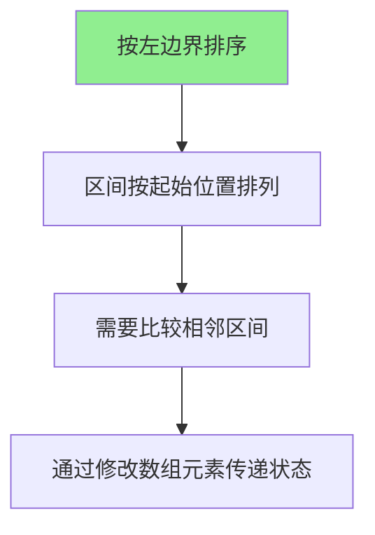
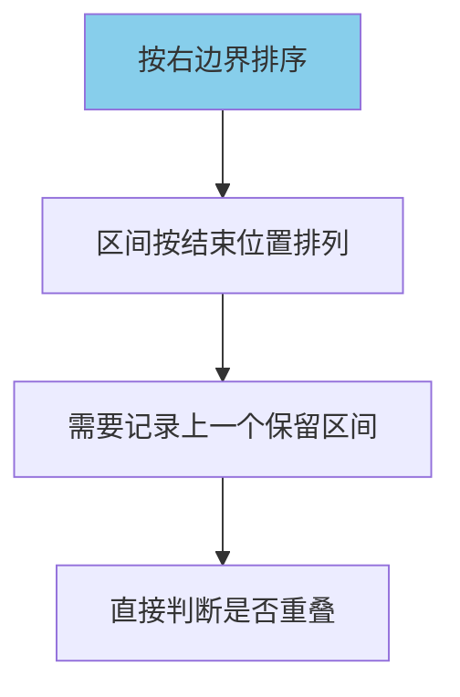

# 无重叠区间

#### 题目描述

给定一个区间的集合 `intervals` ，其中 `intervals[i] = [starti, endi]` 。返回 *需要移除区间的最小数量，使剩余区间互不重叠* 。

**注意** 只在一点上接触的区间是 **不重叠的**。例如 `[1, 2]` 和 `[2, 3]` 是不重叠的。

题目链接：https://leetcode.cn/problems/non-overlapping-intervals/

文章讲解：https://programmercarl.com/0435.%E6%97%A0%E9%87%8D%E5%8F%A0%E5%8C%BA%E9%97%B4.html

#### 思考

问题最终状态是需要达到剩余区间互不重叠，且移除区间尽可能少，换句话说就是剩余区间尽可能多。

区间总个数是固定的，所以尽可能少地移除，就是使非重叠区间尽可能多，实际上等价于是让我们求非重叠区间的最大个数。

肯定还是需要排序。**按照右边界排序，还是按照左边界排序呢？**

假设按照左区间排序把。遍历所有区间：

- 如果当前区间与前一个区间重叠：

  	- 优先保留右端点更小的区间（这样更不容易与后面的区间重叠）

  	- 通过更新当前区间的右端点为两个区间右端点的较小值，等价于移除右端点更大的那个区间

- 如果不重叠，则什么都不做，继续遍历

#### 代码实现

左边界排序

```C++
static bool cmp(const vector<int> &a, const vector<int> &b) {
    return a[0] < b[0];
}
int eraseOverlapIntervals(vector<vector<int>> &intervals) {
    // 首先按照区间的起始位置进行排序，方便后续处理相邻区间
    sort(intervals.begin(), intervals.end(), cmp);
    int result = 0;
    for (int i = 1; i < intervals.size(); i++) {
        // 如果当前区间与前一个区间重叠
        if (intervals[i][0] < intervals[i - 1][1]) {
            result++;
            // 贪心策略：每次遇到重叠时，优先保留右端点更小的区间（这样更容易与后面的区间不重叠）
            // 通过更新当前区间的右端点为两个区间右端点的较小值，等价于移除右端点更大的那个区间
            intervals[i][1] = min(
                intervals[i - 1][1],
                intervals
                    [i]
                    [1]); // 这里的逻辑是更新为两者之间的靠左的右边界，相当于删除了那个靠右的右边界的区间。
        }
        // 如果不重叠，则什么都不做，继续遍历
    }
    return result;
}
```

右边界排序

```C++
static bool cmp(const vector<int> &a, const vector<int> &b) {
    return a[1] < b[1];  // 按照右边界排序
}

int eraseOverlapIntervals(vector<vector<int>> &intervals) {
    sort(intervals.begin(), intervals.end(), cmp);
    int result = 0;
    int prev = 0;  // 记录上一个保留的区间索引
    
    for (int i = 1; i < intervals.size(); i++) {
        // 如果当前区间与上一个保留的区间重叠
        if (intervals[i][0] < intervals[prev][1]) {
            result++;  // 移除当前区间
        } else {
            prev = i;  // 保留当前区间
        }
    }
    return result;
}

```

##### 按左边界排序的特点：



1. **区间排列**：区间按照起始位置从左到右排列
2. **重叠判断**：只需要比较相邻区间（i和i-1）
3. **状态传递**：通过修改`intervals[i][1]`来传递当前应该保留区间的右边界
4. **贪心策略**：当发生重叠时，保留右端点较小的区间

##### 按右边界排序的特点：



1. **区间排列**：区间按照结束位置从左到右排列
2. **重叠判断**：需要记录上一个保留的区间，比较当前区间与上一个保留区间
3. **状态传递**：通过`prev`变量记录上一个保留区间的索引
4. **贪心策略**：优先选择结束位置早的区间，为后续区间留出更多空间

##### 实例对比分析

考虑区间：[[1,2],[2,3],[3,4],[1,3]]

按左边界排序：

```
排序后：[[1,2],[1,3],[2,3],[3,4]]

处理过程：
1. 比较[1,2]和[1,3]：1<2，重叠，移除[1,3]，保留[1,2]
2. 比较[1,2]和[2,3]：2<2？不重叠
3. 比较[2,3]和[3,4]：3<3？不重叠
结果：移除1个区间
```

按右边界排序：

```
排序后：[[1,2],[2,3],[3,4],[1,3]]

处理过程：
1. 保留[1,2]，prev=0
2. 比较[2,3]与[1,2]：2<2？不重叠，保留[2,3]，prev=1
3. 比较[3,4]与[2,3]：3<3？不重叠，保留[3,4]，prev=2
4. 比较[1,3]与[3,4]：1<4，重叠，移除[1,3]
结果：移除1个区间
```

##### 算法正确性分析

按左边界排序的正确性：

- 贪心策略：当两个区间重叠时，保留右端点较小的区间能为后续区间留出更多空间
- 通过修改数组元素来传递状态是有效的

按右边界排序的正确性：

- 贪心策略：优先选择结束位置早的区间，为后续区间留出最大空间
- 这是经典的贪心算法思路，用于解决区间调度问题

#### 时间复杂度和空间复杂度

按左边界排序：

- 时间复杂度：O(n log n)（排序）+ O(n)（遍历）= O(n log n)
- 空间复杂度：O(1)（不考虑排序空间）

按右边界排序：

- 时间复杂度：O(n log n)（排序）+ O(n)（遍历）= O(n log n)
- 空间复杂度：O(1)（不考虑排序空间）

##### 8. 结论

两种排序方式都能正确解决问题，但有以下区别：

1. **贪心策略不同**：
   - 按左边界排序：重叠时保留右端点小的区间
   - 按右边界排序：优先选择结束位置早的区间

2. **实现方式不同**：
   - 按左边界排序：通过修改数组元素传递状态
   - 按右边界排序：通过变量记录状态

3. **代码清晰度**：
   - 按右边界排序的实现更符合经典的贪心算法思路，代码更清晰

4. **实际应用**：
   - 按右边界排序的方法更通用，容易扩展到其他区间调度问题

