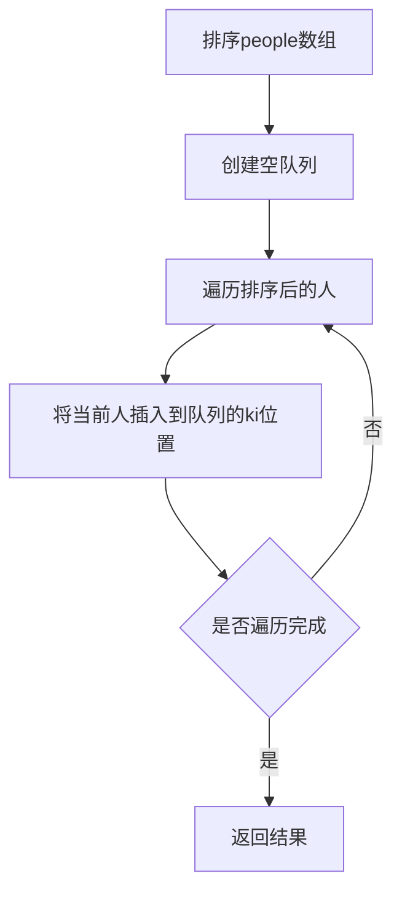

# 根据身高重建队列

#### 题目描述

假设有打乱顺序的一群人站成一个队列，数组 `people` 表示队列中一些人的属性（不一定按顺序）。每个 `people[i] = [hi, ki]` 表示第 `i` 个人的身高为 `hi` ，前面 **正好** 有 `ki` 个身高大于或等于 `hi` 的人。

请你重新构造并返回输入数组 `people` 所表示的队列。返回的队列应该格式化为数组 `queue` ，其中 `queue[j] = [hj, kj]` 是队列中第 `j` 个人的属性（`queue[0]` 是排在队列前面的人）。

题目链接：https://leetcode.cn/problems/queue-reconstruction-by-height/

文章讲解：https://programmercarl.com/0406.%E6%A0%B9%E6%8D%AE%E8%BA%AB%E9%AB%98%E9%87%8D%E5%BB%BA%E9%98%9F%E5%88%97.html

#### 思考

我们发现queue中，一个人的顺序取决于两个属性，身高h和前面的个数k。另外说了“前面**正好** 有ki 个身高不比他矮的人”，即前面的不能比他矮。

我们有一群人，每个人有两个属性：

- `hi`：身高
- `ki`：前面**正好**有ki个身高大于或等于hi的人，前面的人不能比他矮。

目标是根据这些信息重建正确的队列顺序。

我们在排序的时候不能同时考虑两个属性，和**分发糖果**一样，两个同时考虑会顾此失彼。那么我们应该先确定哪个顺序？h还是k？

如果按照k从小到大，发现没道理，k从小到大或者从大到小没任何意义。

因此按照身高，从大到小排列，高个子在前面。

排序时的策略

```C++
static bool cmp(const vector<int> &a, const vector<int> &b) {
    if (a[0] == b[0])
        return a[1] < b[1];  // 身高相同，按ki升序
    return a[0] > b[0];      // 身高不同，按身高降序
}

```

##### 为什么要这样排序？

1. **按身高降序排列**：
   - 身高高的人先处理，因为他们的插入不会影响后续身高矮的人的ki值
   - 当我们处理身高较矮的人时，队列中已经存在的都是身高更高或相等的人
2. **身高相同时按ki升序**：
   - 对于身高相同的人，ki值小的应该排在前面
   - 这样可以确保后续插入的人不会影响前面已经放置的人的相对位置




按照身高排序之后，优先按身高高的people的k来插入，后续插入节点也不会影响前面已经插入的节点，最终按照k的规则完成了队列。

关键在于：

- 当我们处理某个人时，队列中已经存在的人都比他高或等高
- 因此，他在插入到ki位置时，前面正好有ki个身高大于或等于他的人
- 后续插入的矮个子不会影响他已经满足的条件

回归本题，整个插入过程如下：

排序完的people： [[7,0], [7,1], [6,1], [5,0], [5,2], [4,4]]

插入的过程：

- 插入[7,0]：[[7,0]]
- 插入[7,1]：[[7,0],[7,1]]
- 插入[6,1]：[[7,0],[6,1],[7,1]]
- 插入[5,0]：[[5,0],[7,0],[6,1],[7,1]]
- 插入[5,2]：[[5,0],[7,0],[5,2],[6,1],[7,1]]
- 插入[4,4]：[[5,0],[7,0],[5,2],[6,1],[4,4],[7,1]]

此时就按照题目的要求完成了重新排列

##### 为什么身高相同时按ki升序？

考虑身高相同的人：[5,0], [5,2]

- 如果先处理[5,2]，插入到位置2，队列变为[?, ?, [5,2]]
- 再处理[5,0]，插入到位置0，队列变为[[5,0], ?, [5,2]]
- 这样[5,2]前面实际上只有1个身高≥5的人，不符合ki=2的要求

但如果按ki升序处理：

- 先处理[5,0]，插入到位置0，队列变为[[5,0]]
- 再处理[5,2]，插入到位置2，队列变为[[5,0], ?, [5,2]]
- 由于队列中只有[5,0]一个身高≥5的人，所以[5,2]前面需要再有1个身高≥5的人
- 但队列中只有2个位置，[5,2]在位置2，前面只有位置0和1，位置1必须是身高≥5的人

这就是为什么身高相同时要按ki升序排列。

#### 代码实现

```C++
class Solution {
public:
    static bool cmp(const vector<int>& a,const vector<int>& b){
            if(a[0] == b[0]) return a[1] < b[1];
            return a[0] > b[0];
    }
    vector<vector<int>> reconstructQueue(vector<vector<int>>& people) {
        sort(people.begin(),people.end(),cmp);
        list<vector<int>> queue;
        for(int i = 0;i < people.size();i++){
            int position = people[i][1];
            auto it = queue.begin();
            advance(it,position);
            queue.insert(it, people[i]);
        }
        return vector<vector<int>>(queue.begin(),queue.end());

    }
};
```

以上代码，如果cmp函数写在类内部，需要加上static关键字，因为如果不加，就是一个成员函数，成员函数默认会接受一个this指针，指向调用成员，然而sort函数比较函数，它并不期望是某一个对象的某个方法。

因此需要标记为static。

当然如果写在类外，全局，则不用static
