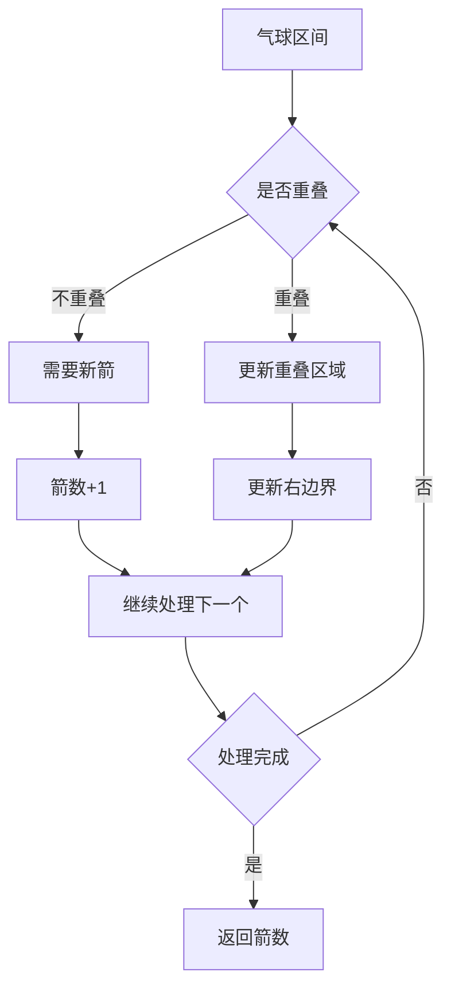

# 用最少数量的箭引爆气球

#### 题目描述

有一些球形气球贴在一堵用 XY 平面表示的墙上。墙上的气球记录在整数数组 points ，其中points[i] = [xstart, xend] 表示水平直径在 xstart 和 xend之间的气球。你不知道气球的确切 y 坐标。

一支弓箭可以沿着 x 轴从不同点完全垂直地射出。在坐标 x 处射出一支箭，若有一个气球的直径的开始和结束坐标为 xstart，xend， 且满足  xstart ≤ x ≤ xend，则该气球会被引爆。可以射出的弓箭的数量没有限制。 弓箭一旦被射出之后，可以无限地前进。

给你一个数组 points ，返回引爆所有气球所必须射出的最小弓箭数。

题目链接：https://leetcode.cn/problems/minimum-number-of-arrows-to-burst-balloons/

文章讲解：https://programmercarl.com/0452.%E7%94%A8%E6%9C%80%E5%B0%91%E6%95%B0%E9%87%8F%E7%9A%84%E7%AE%AD%E5%BC%95%E7%88%86%E6%B0%94%E7%90%83.html

#### 思考

只射重叠最多的气球，用的弓箭一定最少。

无论如何，需要先对气球进行排序，才能知晓重叠范围，否则它们隔着十万八千里。

那么按照气球起始位置排序，还是按照气球终止位置排序呢？

其实都可以！只不过对应的遍历顺序不同，假设按照气球的起始位置排序了。

**如果气球重叠了，重叠气球中右边边界的最小值 之前的区间一定需要一个弓箭**。

以题目示例： [[10,16],[2,8],[1,6],[7,12]]为例，如图：（方便起见，已经排序）


可以看出首先第一组重叠气球，一定是需要一个箭

气球3，的左边界大于了 第一组重叠气球的最小右边界，所以再需要一支箭来射气球3了。

或者这么理解，第一个气球，一定需要一个箭，第二个气球因为与第一个气球有重叠，或者第二个气球的左边界小于第一支气球的右边界，所以不需要另外的箭。

第三只气球需不需要再用一只箭？需要，因为第三只气球左边界小于重叠区间的右边界（注意，这里是重叠区间的右边界，而非前一个气球的右边界）。

**所以我们认为当前气球左边界大于已知重叠区间的右边界时就需要多一只箭。否则不需要多一只箭，而只是更新重叠区间右边界就行了**

怎么更新重叠区间的右边界？

应该保持最小。

例如[1,6]  ,[2,4],这时重叠区间右边界是4了。选择哪个右边界小的气球即可。

需要另外使用一个变量保存重叠区间右边界吗？

不需要，将前一个气球的右边界设置为重叠区间右边界即可，当然也可以使用一个单独的变量。

因为题目说满足 xstart ≤ x ≤ xend，则该气球会被引爆。那么说明两个气球挨在一起，不重叠也可以一起射爆，




#### 代码实现

使用气球右边界保存重叠区间右边界

```C++
int findMinArrowShots(vector<vector<int>>& points) {
    sort(points.begin(),points.end(),[](vector<int>& a,vector<int>& b){return a[0] < b[0];});
    int result = 1;
    for(int i = 1;i < points.size();i++){
        if(points[i][0] > points[i-1][1]){
            result++;
        } else {
            points[i][1] = min(points[i-1][1],points[i][1])
        }
    }
    return result;
}
```

单独变量来保存重叠区间右边界

```C++
#include <algorithm>
#include <vector>
using namespace std;

static bool cmp(const vector<int>& a, const vector<int>& b){
    return a[0] < b[0];
}

int findMinArrowShots(vector<vector<int>>& points) {
    if (points.empty()) return 0;
    
    // 1. 按照区间左端点排序
    sort(points.begin(), points.end(), cmp);
    
    // 2. 初始化箭数为1，右边界为第一个区间的右端点
    int result = 1;
    int rightBoundary = points[0][1];  // 使用变量保存当前重叠区间的右边界
    
    // 3. 遍历所有区间
    for(int i = 1; i < points.size(); i++){
        // 4. 判断当前区间是否与前面的区间重叠
        if(points[i][0] > rightBoundary){
            // 4.1 不重叠，需要新增一支箭
            result++;
            // 4.2 更新右边界为当前区间的右端点
            rightBoundary = points[i][1];
        } else {
            // 4.3 重叠，更新右边界为两个区间右端点的较小值
            rightBoundary = min(rightBoundary, points[i][1]);
        }
    }
    
    return result;
}

int main(){}

```

